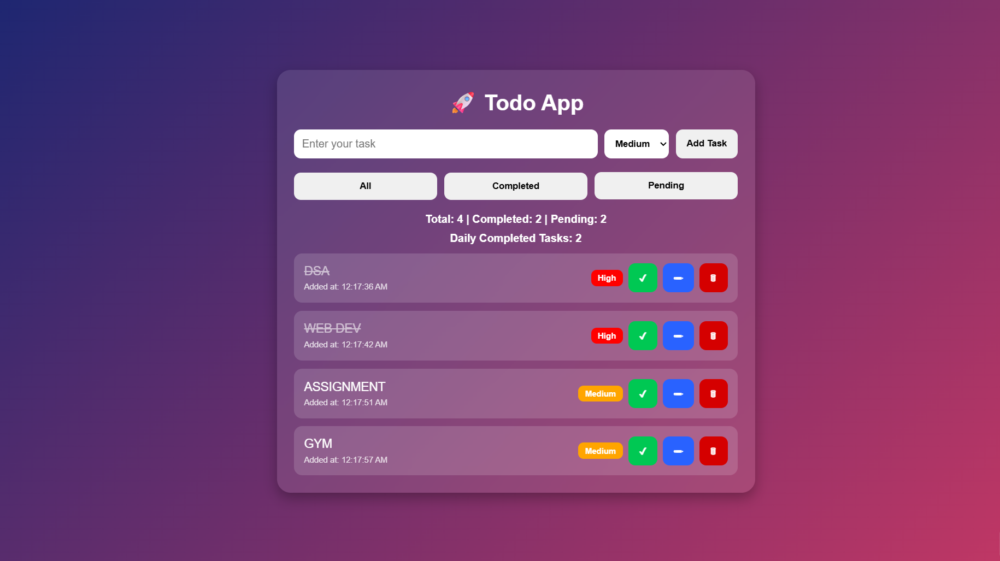

# 🚀 TaskFlow Todo App

A modern and responsive Todo App built using HTML, CSS, and JavaScript.
This project helps users manage daily tasks efficiently with features like task priorities, filters, counters, and local storage support.

---

## ✨ Features

* ➕ Add, Edit, and Delete Tasks
* ✅ Mark Tasks as Completed
* 🎯 Task Priority Levels (High / Medium / Low)
* 📊 Daily Completed Task Counter
* 📌 Pending Task Counter
* 🔍 Task Filters (All / Completed / Pending)
* 💾 Local Storage Support
* 📱 Fully Responsive UI

---

## 🛠 Technologies Used

* HTML5
* CSS3
* JavaScript (ES6)

---

## 🌍 Live Demo

https://aman-singh-chauhan.github.io/taskflow-todo-app/

---

## 📸 Screenshot



---

## 📁 Folder Structure

```txt
TODO APP/
│
├── index.html
├── style.css
├── app.js
├── README.md
│
└── screenshots/
    └── homepage.png
```

---

## 🚀 Future Improvements

* Add Dark Mode Toggle
* Add Drag and Drop Task Reordering
* Add Task Categories and Labels
* Add Due Date Notifications
* Add Search Functionality
* Add Progress Analytics Dashboard
* Improve Mobile Responsiveness
* Add Backend Database Support
* Add User Authentication System
* Convert Project into React Application

---

## 👨‍💻 Author

Aman Singh Chauhan
